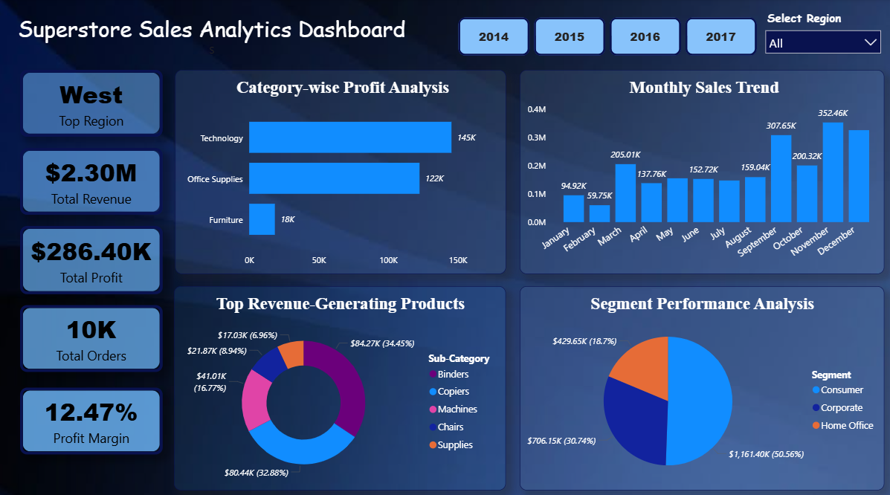

# Superstore Sales Analytics Project

## Project Overview
This project analyzes Superstore sales data using Excel, Python, SQL, and Power BI to generate meaningful business insights and build an interactive dashboard for decision-making.

## Project Objective
The main objectives of this project are:
- Analyze overall sales and profit performance
- Identify top-performing products
- Study monthly and seasonal sales trends
- Find the most profitable categories and regions
- Generate business recommendations for growth
- Build an interactive Power BI dashboard

## Tools Used
- Excel
- Python
- SQL
- Power BI

## Dataset Used
Superstore Sales Dataset

Dataset link:
https://www.kaggle.com/datasets/vivek468/superstore-dataset-final

## Project Workflow
1. Cleaned and prepared the dataset in Excel  
2. Performed data analysis and visualization using Python  
3. Executed business queries using SQL  
4. Built an interactive dashboard in Power BI  

## Key Insights
- Identified top-performing products
- Analyzed monthly sales trends
- Compared category-wise and region-wise profitability
- Found Furniture to be the lowest-profit category across all years
- Generated business recommendations for growth and profitability

## Dashboard Features
- KPI Cards
- Sales Trend Analysis
- Top Products Visualization
- Region-wise Performance
- Category-wise Analysis
- Interactive Filters and Slicers

## Skills Demonstrated
- Data Cleaning & Preparation
- Data Analysis
- SQL Querying
- Data Visualization
- Dashboard Development
- Business-focused KPI Analysis
- Insight Generation and Reporting
- Trend and Performance analysis
- Business storytelling using data

## Dashboard Preview

## Author
Sahinka Sarkar

